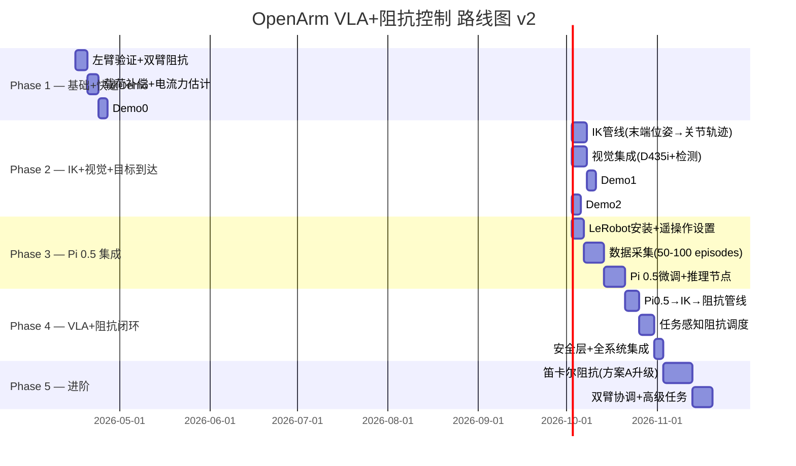

# OpenArm VLA + 变阻抗控制 — 总体路线图 v2

> 日期：2026-04-15 (v2 — 根据你的反馈全面修订)  
> 范围：从当前关节空间阻抗控制器 → 完整的 Pi 0.5 VLA 驱动变阻抗操作系统

---

## 0. 现状总结与核心设计决策

### 0.1 已确认的技术决策

| 决策项 | 选择 | 理由 |
|--------|------|------|
| **力传感器** | ❌ 不使用 F/T 传感器 | QDD 电机原生支持电流反馈，本体感知足够 |
| **力估计方式** | MIT 模式电流反馈 + 动量观测器 | 充分利用 DaMiao 的 QDD 特性 |
| **VLA 模型** | π₀.₅ (Pi 0.5) via LeRobot | OpenArm 原生支持，LeRobot 已有集成 |
| **VLM** | 可选（GPT-4V），主路径 VLA-only | 先不依赖 VLM，Pi 0.5 自带视觉-语言理解 |
| **阻抗空间** | 先关节空间+IK（方案B），后升笛卡尔（方案A） | 快速验证，降低风险 |
| **验证顺序** | 右臂先行 | 已有完整标定和验证 |
| **视觉** | RealSense D435i + 已有 vision pipeline | 你已有完整的 Openarm_ROS2_Vision 代码 |
| **GPU** | RTX 5080 笔记本 (16GB VRAM) | 需要 bfloat16/量化才能跑 Pi 0.5 |

### 0.2 你已有的关键资源（比之前评估的更多！）

| 资源 | 位置 | 状态 |
|------|------|------|
| 右臂关节阻抗控制器 | `openarm_compliance_controller/` | ✅ 硬件验证通过 |
| Mock VLA 推理节点 | `openarm_vla_mock/vla_inference_node.py` | ✅ 可扩展为真实 Pi 0.5 |
| VLA Pose Bridge（含 TF 变换+工作空间验证） | `openarm_vla_mock/vla_pose_bridge.py` | ✅ 可复用 |
| Camera TF Publisher | `openarm_vla_mock/camera_tf_publisher.py` | ✅ RealSense 静态 TF |
| RealSense D435i 视觉系统 | `Openarm_ROS2_Vision/vision_advanced/` | ✅ YOLO 检测 + 3D 定位 + 抓取规划 |
| 手眼标定工具 | `Openarm_ROS2_Vision/hand_eye_calibration.py` | ✅ 已实现 |
| MoveIt 2 集成 | `moveit2/` in workspace | ✅ 已编译 |
| LeRobot + OpenArm CAN 集成 | [HuggingFace docs](https://huggingface.co/docs/lerobot/openarm) | ✅ 官方支持 |
| 遥操作数据采集框架 | LeRobot `lerobot-record` | ✅ 可直接用 |
| 电机力矩反馈诊断脚本 | `scripts/motor_feedback_diagnostic.py` | ✅ 新创建 |

### 0.2b 相机配置（3相机系统）

```
         RealSense D435i (Robot Head, Z=63cm)
            全局俯视视角 - 场景理解
            RGB 640x480 + Depth
                    |
     +--------------+--------------+
     |                             |
 RealSense D405              RealSense D405
 (Left Wrist)                (Right Wrist)
 近距离精密视角               近距离精密视角
 Eye-in-hand                 Eye-in-hand
```

> [!TIP]
> 这个 3 相机配置**对 Pi 0.5 非常理想**！Pi 0.5 支持多视角输入，典型配置就是 1 个全局相机 + 1-2 个腕部相机。你的硬件完全匹配这个需求。

### 0.3 QDD 本体感知的核心优势

OpenArm 使用达妙（DaMiao）QDD 电机，这是一个**非常重要的设计特性**：

```
QDD（准直驱）电机的独特之处：
├── 反驱动性 → 外力可以直接反向驱动电机 → 天然适合阻抗控制
├── 低减速比 → 力矩透明度高 → 电流 ≈ 力矩（误差小）
├── MIT 模式 → 同时控制 {pos, vel, kp, kd, tau_ff} → 完美匹配阻抗控制
└── 电流反馈 → 不需要外部 F/T 传感器就能估计外力
```

**电流/力矩映射**：
```
τ_actual ≈ K_t * I_motor    (K_t = 电机力矩常数)
τ_external ≈ τ_actual - τ_model(q, dq, ddq)
```

**代码验证结果** -- 达妙电机 API (`dm_motor.hpp`) 已确认提供力矩反馈：
```cpp
// 可用的状态反馈 getters:
double get_position() const;   // state_q_   -- 位置
double get_velocity() const;   // state_dq_  -- 速度
double get_torque()  const;    // state_tau_ -- 力矩反馈 <<<关键!
int get_state_tmos() const;    // MOS温度
int get_state_trotor() const;  // 转子温度
```

硬件接口已将 `get_torque()` 暴露为 `HW_IF_EFFORT` state interface:
`tau_states_[i] = arm_motors[i].get_torque()` -- 通过 `/joint_states` 的 `effort` 发布。

> [!TIP]
> 本体感知力估计已确认可行! 我已创建诊断脚本 `motor_feedback_diagnostic.py` 来验证真实硬件上的数值。

这意味着我们可以用**纯本体感知（proprioceptive）**的方式做力估计，无需 F/T 传感器。

---

## 1. 总体路线图（五阶段，重新设计）



---

## Phase 1：基础完善 + 快速 Demo（~2 周）

> **目标**：双臂阻抗可用 + 载荷补偿 + **第一个视觉冲击力的 Demo**

### 🎯 Demo 0（你提出的最简单 Demo）

你的想法非常好——这是一个**零依赖、纯阻抗控制**的 Demo：

```
Demo 0: 挂载 2kg 负载的右臂，在 A 点和 B 点之间持续循环运动
        要求：运动过程中手臂不下沉、平稳、无抖动
        对比：关闭阻抗控制器（tau_ff=0）时，同样运动下手臂明显下沉
```

**为什么这个 Demo 很有效？**
- 直接证明了阻抗控制+前馈力矩的价值
- 不需要视觉、VLA、IK 等任何额外组件
- 可以录视频做对比：有 tau_ff vs 无 tau_ff
- 也验证了载荷补偿能力

---

### 任务 1.1：左臂阻抗验证 + 双臂同时控制

**工作内容**：
1. Spawn `left_compliance_controller`，验证 KDL 链
2. 左臂 HW-1 ~ HW-5 测试
3. 同时 spawn 双臂 compliance controller
4. 验证 hardware interface 不冲突

**预计工作量**：4 天

---

### 任务 1.2：载荷补偿 + 电流反馈力估计

**工作内容**：

#### 1.2a 载荷补偿（从 legacy code 移植）
- 在 `ComplianceController` 添加 `~/set_payload` service
- 动态修改 KDL 末端段惯性
- 低通滤波器平滑质量注入

```cpp
// 接口设计
// Service: ~/set_payload
// Request: {mass: float64, cog_x: float64, cog_y: float64, cog_z: float64}
// Response: {success: bool}
```

#### 1.2b 电流反馈力估计（本体感知）

> [!IMPORTANT]
> 这是代替 F/T 传感器的核心模块。利用 QDD 电机的电流反馈做外力估计。

**方法 1 — 电流差分法（最简单）**：
```
τ_external ≈ K_t × I_measured - τ_model(q, q̇)
```
需要确认：DaMiao 电机 CAN 反馈是否包含 **电流值**？

**方法 2 — 动量观测器（更鲁棒）**：
```
r(t) = K_O × [M(q)q̇ - ∫(τ_motor + Cᵀq̇ - g(q) + r)dt]
外力估计 ≈ r(t)
```

**需要确认的问题**：

> [!WARNING]
> **Q_new_1**：DaMiao 电机通过 CAN-FD 反馈哪些数据？是否包含：
> - ✅ 位置 (position)
> - ✅ 速度 (velocity)  
> - ❓ 电流 (current) — 如果有，可以直接用电流差分法
> - ❓ 温度 (temperature)
>
> 请确认你的 `openarm_can` driver 是否暴露了电流读数（我在 `joint_states` 里只看到 position/velocity/effort，这里的 effort 是电流反馈还是指令值？）

**预计工作量**：4 天

---

### 任务 1.3：Demo 0 实现 — 2kg 负载 A↔B 连续运动

**工作内容**：
1. 创建 ROS 2 节点 `impedance_demo_ab.py`
2. 定义安全的 A 点和 B 点（关节空间 waypoints，在仿真中验证）
3. 使用 JTC 发送连续轨迹
4. 循环执行 N 轮，记录 tau_ff、关节误差、运动平稳性
5. 录制两段视频：有阻抗 vs 无阻抗对比

**A/B 点建议**（需要你确认安全性）：
```python
# 安全的 pick-place 风格 waypoints
POINT_A = [0.0, 0.785, 0.0, 0.785, 0.0, 0.0, 0.0]   # J2=45°, J4=45°
POINT_B = [0.5, 0.785, 0.0, 1.047, 0.0, 0.0, 0.0]    # J1=30°, J4=60°
DURATION = 3.0  # 每段 3 秒
CYCLES = 20     # 连续 20 轮
```

**验收标准**：
| 指标 | 有阻抗 | 无阻抗 |
|------|--------|--------|
| 位置跟踪误差 (RMS) | < 0.5° | > 2° |
| 运动中最大位置偏移 | < 1° | > 5° (下沉) |
| 到达后稳态误差 | < 0.2° | > 1° |
| 20轮连续运行 | 稳定 | 可能发散 |

**预计工作量**：3 天

---

### 🏁 Phase 1 里程碑

> **Gate 1**：60秒对比视频 —— "这是没有阻抗补偿的2kg负载运动（手臂下沉、抖动），这是有阻抗补偿的（平稳、精确）"

---

## Phase 2：IK + 视觉 + 目标到达（~3 周）

> **目标**：给一个**笛卡尔空间目标位姿** {x,y,z,r,p,y}，机器人能用 IK 到达，且支持变阻抗

### 关于你的问题："可以用 mock VLA 生成末端位姿让机器人过去吗？IK 在哪里做？"

**答案是：完全可以！** 你的 mock VLA 已经输出 `PoseStamped`（末端位姿），VLA Pose Bridge 已经做了坐标变换和工作空间验证。缺的只有一环：**IK（逆运动学）把末端位姿变成关节角度**。

```
当前流程:
  Mock VLA → PoseStamped (末端位姿) → ??? → JTC (需要关节角度)
                                       ↑
                                    缺了 IK！

目标流程:
  Mock VLA → PoseStamped → IK (MoveIt/KDL) → 关节轨迹 → JTC
                                                    ↑
                                           阻抗控制器同步调节 Kp/Kd
```

### 任务 2.1：IK 管线 — 末端位姿 → 关节轨迹 → JTC 执行

**方案（使用 MoveIt 2，你已经编好了）**：

```python
# IK 执行流程
class CartesianGoalExecutor(Node):
    """
    订阅: /target_pose (PoseStamped) — 来自 VLA 或手动发布
    执行: MoveIt IK → 关节轨迹 → JTC FollowJointTrajectory
    """
    def target_callback(self, pose_msg: PoseStamped):
        # 1. 用 MoveIt 做运动规划 (IK + 路径规划)
        plan = planning_component.plan(goal_pose=pose_msg)
        
        # 2. 如果规划成功，执行轨迹
        if plan.error_code == SUCCESS:
            planning_component.execute()
```

**替代方案（更轻量，不需要 MoveIt）**：
```python
# 直接用 KDL 做 IK
from kdl_kinematics import KDLKinematics
ik_solver = KDLKinematics(urdf, root_link, tip_link)
q_target = ik_solver.inverse(target_pose, q_current)  # IK 求解
# → 发送 q_target 到 JTC
```

**建议**：先用 MoveIt（你已经有了），因为它自带碰撞检测和路径规划。

**预计工作量**：5 天

---

### 任务 2.2：视觉集成 — RealSense D435i

> [!IMPORTANT]
> 你已经有了一套完整的视觉系统！这部分工作量比我之前估计的小很多。

**已有代码（`Openarm_ROS2_Vision`）**：
- `object_detector.py` — YOLO 检测 + 深度 3D 定位（325 行）
- `hand_eye_calibration.py` — 手眼标定
- `grasp_planner.py` — 抓取位姿生成
- `pick_place_demo.py` — 完整 pick-place 流程
- `camera_bringup.launch.py` — RealSense 启动

**需要做的**：
1. 将 `vision_advanced` 包从 scratch 拷贝到 `ros2_ws/src/` 并编译
2. 确认相机硬件和USB连接
3. 运行手眼标定
4. 连接 `object_detector.py` 的 `/object_poses` 到 IK 执行器
5. 验证端到端：相机看到物体 → 3D 位姿 → IK → 机器人到达

**数据流**：
```
RealSense D435i ──RGB+Depth──→ object_detector.py ──/object_poses──→ IK Executor
                                                                         ↓
                                                              JTC + Compliance Controller
```

**预计工作量**：5 天（与 2.1 并行）

---

### 任务 2.3：Demo 1 — 视觉目标到达

```
Demo 1: 放一个目标物（杯子/瓶子）在桌面上
        → 相机检测到物体 → 计算 3D 位姿
        → IK 规划 → 机器人移动到物体上方
        → 先用高刚度接近，到达后降低刚度（变柔顺）
```

**实现**：可以直接利用 mock VLA 的框架——把 `MockVLAInferenceServer` 改为从 `/object_poses` 读取真实检测结果而非随机值。

**预计工作量**：3 天

---

### 任务 2.4：Demo 2 — 变阻抗抓取

```
Demo 2: 完整的 pick-and-place with variable impedance
  Phase 1: Approach (Kp=default, 高刚度) — 精确到达目标上方
  Phase 2: Descend (Kp 逐步降低) — 柔顺下降到抓取高度
  Phase 3: Grasp  (夹爪关闭 + 载荷补偿注入)
  Phase 4: Lift + Transport (Kp=default, 高刚度)
  Phase 5: Place (Kp 降低) — 柔顺放下
  Phase 6: Release (夹爪打开 + 载荷补偿清零)
```

**预计工作量**：3 天

---

### 🏁 Phase 2 里程碑

> **Gate 2**：机器人能看到桌上的物体 → IK 到达 → 变阻抗抓取 → 搬运 → 放下。视频展示刚度动态变化（GUI 实时显示）。

---

## Phase 3：Pi 0.5 集成（~3 周）

> **目标**：从 Mock VLA 升级为真实的 Pi 0.5 模型

### 与 LeRobot 的集成路径

LeRobot 已经原生支持 OpenArm，这是一个**巨大的优势**。整个路径：

```
Step 1: LeRobot 安装 + OpenArm CAN 配置
Step 2: 遥操作（Leader-Follower）验证
Step 3: 数据采集（lerobot-record）
Step 4: Pi 0.5 微调（lerobot-train）
Step 5: Pi 0.5 推理 → ROS 2 桥接
```

### 任务 3.1：LeRobot 环境搭建

**工作内容**：
1. 安装 LeRobot：`pip install -e ".[damiao,pi]"`
2. CAN 配置：`lerobot-setup-can --mode=setup --interfaces=can0,can1`
3. 标定：`lerobot-calibrate --robot.type=openarm_follower --robot.port=can0 --robot.side=right`
4. 验证遥操作

> [!WARNING]
> **可能的冲突**：LeRobot 直接控制 CAN 总线，与你的 `ros2_control` 硬件接口冲突。你不能同时运行 LeRobot 和 ROS 2 bringup。
> 
> **解决方案**：
> - **数据采集阶段**：用 LeRobot 独占 CAN（不跑 ROS 2）
> - **推理执行阶段**：用 ROS 2 独占 CAN，Pi 0.5 推理节点只通过 ROS topic 通信
> - 或者：直接在 ROS 2 框架内整合 Pi 0.5 推理（推荐）

**预计工作量**：4 天

---

### 任务 3.2：数据采集（无 Leader 臂）

由于没有 Leader 臂，我们有两种高质量的替代方案：

#### 方案 A：拖拽示教（Drag-to-Teach）-- 推荐首选

利用你的阻抗控制器实现"零重力"模式，人手直接拖拽机器人完成任务：

```
拖拽示教流程：
1. 启动阻抗控制器
2. 将 Kp 降到 safety floor -- 手臂变柔顺
3. tau_ff 保持补偿重力 -- 手臂 "失重" 状态
4. 人手拖拽机器人完成 pick-and-place 任务
5. 同时记录: {joint_states, 3个相机图像, gripper_state}
6. 完成 50-100 个 episodes
```

**优势**：
- 不需要任何额外硬件
- 你的阻抗控制器让拖拽非常自然（重力补偿+低刚度）
- 直接记录 follower 臂关节数据，Pi 0.5 格式友好
- 3 个相机同步记录（D435i 全局 + 2x D405 腕部）

#### 方案 B：UMI（Universal Manipulation Interface）-- 替代选项

UMI 是斯坦福开源的手持式数据采集工具（[umi-gripper.github.io](https://umi-gripper.github.io)）：
- 3D 打印的手持夹爪 + GoPro 相机 + IMU
- 使用 SLAM (ORB-SLAM3) 从视频提取 6D 轨迹
- 硬件无关的数据，可跨机器人部署

| 对比 | 拖拽示教 | UMI |
|---|---|---|
| 额外硬件 | 不需要 | 需 3D 打印夹爪+GoPro |
| 数据类型 | 关节空间 (joint angles) | 末端空间 (6D poses) |
| Pi 0.5 兼容性 | 直接兼容 | 需要 IK 转换 |
| 采集灵活性 | 只能在机器人旁 | 可以任何地方 |

**建议先用拖拽示教**：不需要额外硬件，完美匹配 Pi 0.5 的关节动作空间。

**预计工作量**：7 天（包含采集脚本开发 + 重复采集 + 数据清洗）

---

### 任务 3.3：Pi 0.5 微调 + 推理节点

**微调**（在你的 RTX 5080 上）：
```bash
lerobot-train \
  --dataset.repo_id=your_name/openarm_pick_place \
  --policy.type=pi05 \
  --policy.pretrained_path=lerobot/pi05_base \
  --policy.compile_model=true \
  --policy.gradient_checkpointing=true \
  --policy.dtype=bfloat16 \
  --policy.train_expert_only=true \
  --batch_size=8 \
  --steps=3000
```

> [!IMPORTANT]
> **RTX 5080 内存限制（16GB VRAM）**：
> - `train_expert_only=true` **必须启用** — 冻结 VLM 部分，只训练动作专家
> - `batch_size=8` — 可能需要降到 4
> - `gradient_checkpointing=true` — 必须
> - `dtype=bfloat16` — 必须
> - 推理时可能还需要进一步优化（量化或 torch.compile）

**ROS 2 推理节点**：将 mock VLA 升级为真实 Pi 0.5

```python
# openarm_vla_real/pi05_inference_node.py
class Pi05InferenceNode(Node):
    """
    替代 MockVLAInferenceServer
    输入: 相机图像 + 语言指令
    输出: 关节角度目标 (7-DOF) + 夹爪
    """
    def __init__(self):
        # 加载微调后的 Pi 0.5 模型
        self.policy = Pi05Policy.from_pretrained("your_name/openarm_pi05_finetuned")
        
        # 订阅相机图像
        self.image_sub = self.create_subscription(Image, '/camera/color/image_raw', ...)
        
        # 发布关节目标 (Pi 0.5 直接输出关节角度)
        self.action_pub = self.create_publisher(JointTrajectory, '/pi05_actions', 10)
        
    def infer(self, image):
        # Pi 0.5 推理 → 输出 action chunk (未来 N 步的关节角度)
        actions = self.policy.predict(image, instruction="pick up the red cup")
        # actions.shape = [chunk_size, 8]  (7 joints + 1 gripper)
        return actions
```

**Pi 0.5 动作空间的关键理解**：
```
Pi 0.5 输出的是 **关节空间** 目标 —— 不是末端位姿！
    ├── 7 个关节角度 (absolute 或 relative)
    └── 1 个夹爪值

这意味着：Phase 2 的 IK 管线在用 Pi 0.5 时实际上不需要！
Pi 0.5 直接给关节角度，你只需要通过 JTC 执行。
阻抗控制器独立运行，动态调节刚度。
```

**预计工作量**：7 天

---

### 🏁 Phase 3 里程碑

> **Gate 3**：说 "pick up the red cup" → Pi 0.5 生成动作序列 → 机器人执行抓取 → 搬运到指定位置。全程阻抗控制器保持力矩补偿。

---

## Phase 4：VLA + 阻抗闭环（~2 周）

> **目标**：Pi 0.5 的动作 + 智能阻抗调度 = 安全柔顺操作

### 任务 4.1：Pi 0.5 → JTC → 阻抗 闭环集成

**完整数据流**：
```
               ┌─────────────────────────────────────────┐
               │        Pi 0.5 推理节点 (~5-10 Hz)        │
               │  输入: RGB 图像 + 语言指令                │
               │  输出: 关节角度 [7] + 夹爪 [1]            │
               └──────────────┬──────────────────────────┘
                              │ action chunks (50 步)
                              ▼
               ┌─────────────────────────────────────────┐
               │      Action Executor (50 Hz)             │
               │  1. 插值 action chunk → 平滑轨迹          │
               │  2. 发送到 JTC (FollowJointTrajectory)   │
               │  3. 根据任务 phase → 发布阻抗参数         │
               └──────────┬──────────────┬───────────────┘
                          │              │
                 JTC 执行轨迹     阻抗参数 → compliance controller
                          ↓              ↓
               ┌─────────────────────────────────────────┐
               │      Hardware (DaMiao MIT mode)          │
               │  {q_des, v_des, kp, kd, tau_ff}          │
               └─────────────────────────────────────────┘
```

**预计工作量**：5 天

---

### 任务 4.2：任务感知阻抗调度器

**核心思想**：根据机器人当前的"状态"自动选择阻抗参数

**方案A（规则驱动，无需 VLM）**：
```python
class ImpedanceScheduler(Node):
    """
    根据任务状态自动调度阻抗参数
    """
    PROFILES = {
        "transit":   {"kp": [70, 70, 70, 60, 10, 10, 10], "kd": [2.75, 2.5, 2.0, 2.0, 0.7, 0.6, 0.5]},
        "approach":  {"kp": [50, 50, 50, 40, 8, 8, 8],    "kd": [2.5, 2.0, 1.5, 1.5, 0.5, 0.5, 0.4]},
        "contact":   {"kp": [30, 30, 30, 20, 5, 5, 5],    "kd": [2.0, 1.5, 1.0, 0.8, 0.3, 0.3, 0.2]},
        "grasp":     {"kp": [70, 70, 70, 60, 10, 10, 10], "kd": [2.75, 2.5, 2.0, 2.0, 0.7, 0.6, 0.5]},
    }
    
    def determine_phase(self, joint_error, velocity, ext_force_est):
        """基于本体感知判断任务阶段"""
        if np.linalg.norm(velocity) > 0.5:
            return "transit"
        elif np.linalg.norm(joint_error) > 0.1:
            return "approach"  
        elif ext_force_est > 2.0:  # 检测到外力 → 接触
            return "contact"
        else:
            return "grasp"
```

**方案B（VLM 驱动，可选增强）**：
- 每 1-2 秒调用 GPT-4V：给当前图像 + 任务 → 返回推荐 phase + 阻抗参数
- 仅做为 advisory（建议），不直接控制
- 本体感知安全层优先级高于 VLM 建议

**预计工作量**：5 天

---

### 任务 4.3：安全层

**纯本体感知安全架构（无 F/T 传感器）**：
```
Layer 1: 关节力矩上限 — if |τ_cmd| > τ_max → 截断
Layer 2: 电流反馈外力估计 — if |τ_ext_est| > F_safe → 自动降 Kp
Layer 3: 阻抗参数速率限制 — 复用现有 delta_kp_max 机制
Layer 4: 安全下限 — Kp 永不低于 kp_min（已有）
Layer 5: 工作空间围栏 — 超出边界则停止
Layer 6: 急停 — GUI E-STOP + 热保护
```

**预计工作量**：3 天

---

### 🏁 Phase 4 里程碑

> **Gate 4**：说 "pick up the red cup and put it on the left side" → Pi 0.5 生成动作 → 阻抗调度器根据接触状态自动调 Kp/Kd → 安全完成抓取-搬运-放置

---

## Phase 5：进阶能力（~3 周，可选）

### 任务 5.1：笛卡尔阻抗控制器（方案 A 升级）

在 Phase 4 验证完毕后，如果需要做**接触类任务**（插入、擦拭、推拉），升级到笛卡尔阻抗：
- Jacobian 工具 + FK
- 笛卡尔 6-DOF 阻抗 K,D
- 零空间关节姿态保持

### 任务 5.2：双臂协调

- 双臂同步阻抗调度
- 双臂协作搬运（一臂刚性、一臂柔顺）
- 双手 Pi 0.5 模型

---

## 技术选型确认

### Pi 0.5 在 RTX 5080 上的可行性分析

| 操作 | VRAM 需求 | RTX 5080 (16GB) | 优化策略 |
|------|-----------|-----------------|---------|
| 推理 (bfloat16) | ~12-16 GB | ⚠️ 勉强 | torch.compile + 低分辨率图像 |
| 微调 (full) | ~32+ GB | ❌ 不可行 | — |
| 微调 (expert_only) | ~8-12 GB | ✅ 可行 | gradient_checkpointing + batch=4-8 |
| 推理 (int8 量化) | ~6-8 GB | ✅ 轻松 | 牺牲少量精度 |

**建议路径**：
1. 先用 `train_expert_only=true` 微调（只训练 action expert，冻结 VLM）
2. 推理用 bfloat16 + torch.compile
3. 如果 OOM，降到 int8 量化
4. 图像输入分辨率降到 224×224 或 256×256

### 数据采集策略

**拖拽示教（Drag-to-Teach）-- 利用你的阻抗控制器**：

```
1. 阻抗控制器设为 "teach mode" (Kp=kp_min, tau_ff 保持重力补偿)
2. 手臂进入 "失重" 状态 -- 可自由拖拽
3. 人手拖拽完成任务，同时记录:
   - joint_states (7 joints + gripper) @ 30Hz
   - D435i 全局相机 RGB
   - D405 左腕相机 RGB
   - D405 右腕相机 RGB
4. 转换为 LeRobot 数据格式，上传 HuggingFace
5. 采集 50-100 episodes
```

这种方式的好处：
- 不需要 Leader 臂（省 $1-3k）
- 你的阻抗控制器让拖拽非常自然
- 3 个相机同时记录 -- Pi 0.5 多视角训练
- 直接输出关节空间数据 -- Pi 0.5 原生格式

---

## 完整系统架构图

```
┌───────────────── 感知层 ──────────────────────┐
│  RealSense D435i (Head, Z=63cm)               │
│  ├── RGB + Depth --> YOLO 检测 + 3D 定位       │
│  2x RealSense D405 (Wrist, Eye-in-hand)       │
│  ├── RGB --> Pi 0.5 近距离视角                  │
│  └── 手眼标定 TF                               │
└──────────────────┬─────────────────────────────┘
                   │
┌──────────────────▼──── 决策层 ─────────────┐
│  Pi 0.5 推理 (~5-10 Hz)                    │
│  ├── 输入: RGB + 语言指令                   │
│  ├── 输出: 关节角度 [7] + 夹爪 [1]          │
│  └── Action chunk: 50 步                   │
│                                            │
│  阻抗调度器 (~10 Hz)                        │
│  ├── 本体感知: 电流反馈 → 外力估计          │
│  ├── 状态判断: transit/approach/contact      │
│  └── 输出: Kp[7] + Kd[7] 阻抗参数          │
│                                            │
│  (可选) VLM (~1 Hz)                        │
│  └── GPT-4V → phase + impedance advisory   │
└──────────────────┬─────────────────────────┘
                   │
┌──────────────────▼──── 控制层 ─────────────┐
│  JointTrajectoryController (100 Hz)        │
│  └── 写入: position, velocity              │
│                                            │
│  ComplianceController (100 Hz)             │
│  ├── 读取: q, q̇ (state interfaces)        │
│  ├── 计算: τ_ff = G(q) + C(q,q̇) + F(q̇)   │
│  └── 写入: effort, stiffness, damping      │
└──────────────────┬─────────────────────────┘
                   │
┌──────────────────▼──── 硬件层 ─────────────┐
│  DaMiao QDD Motor (MIT mode, CAN-FD)       │
│  ├── 接收: {q_des, v_des, kp, kd, tau_ff}  │
│  ├── 执行: τ = kp(q_des-q) + kd(v_des-v) + τ_ff │
│  └── 反馈: {q, v, tau} (已确认!)        │
└────────────────────────────────────────────┘
```

---

## 优先级排序 & 时间线总结

| 阶段 | 核心交付 | 预计时间 | 依赖 |
|------|---------|---------|------|
| **Phase 1** | Demo 0: 2kg 负载 A↔B 稳定运动 | ~2 周 | 无 |
| **Phase 2** | Demo 1+2: 视觉目标到达 + 变阻抗抓取 | ~3 周 | Phase 1 |
| **Phase 3** | Pi 0.5 微调 + 推理 | ~3 周 | Phase 2, 数据采集 |
| **Phase 4** | Pi 0.5 + 阻抗闭环 | ~2 周 | Phase 3 |
| **Phase 5** | 笛卡尔阻抗 + 双臂 | ~3 周 | Phase 4 |

**快速赢面（本周可以做）**：
1. ✅ **Phase 1.3 Demo 0** -- 纯阻抗演示，只需写一个简单的 A-B 循环脚本
2. ✅ **拷贝 vision_advanced 到 workspace 并编译** -- 让视觉系统就位
3. ✅ **运行电机诊断脚本** -- 确认力矩反馈数据

---

## 下一步行动：运行电机反馈诊断

诊断脚本已创建: `scripts/motor_feedback_diagnostic.py`

```bash
# 方式 1：先在仿真中验证脚本可运行
# Terminal 1:
ros2 launch openarm_bringup openarm.bimanual.launch.py use_fake_hardware:=true

# Terminal 2 (可选 - spawn compliance controller):
ros2 run controller_manager spawner right_compliance_controller -c /controller_manager

# Terminal 3:
cd ~/ros2_ws && source install/setup.bash
python3 src/impedance_control/openarm_compliance_controller/scripts/motor_feedback_diagnostic.py

# 方式 2：在真实硬件上测试
python3 src/impedance_control/openarm_compliance_controller/scripts/motor_feedback_diagnostic.py --real
```

**脚本会报告**：
1. `/joint_states` 的 `effort` 是否包含非零电机力矩反馈
2. 温度数据
3. `tau_ext = tau_motor - tau_model` 可行性评估

请运行后把输出结果贴给我！

